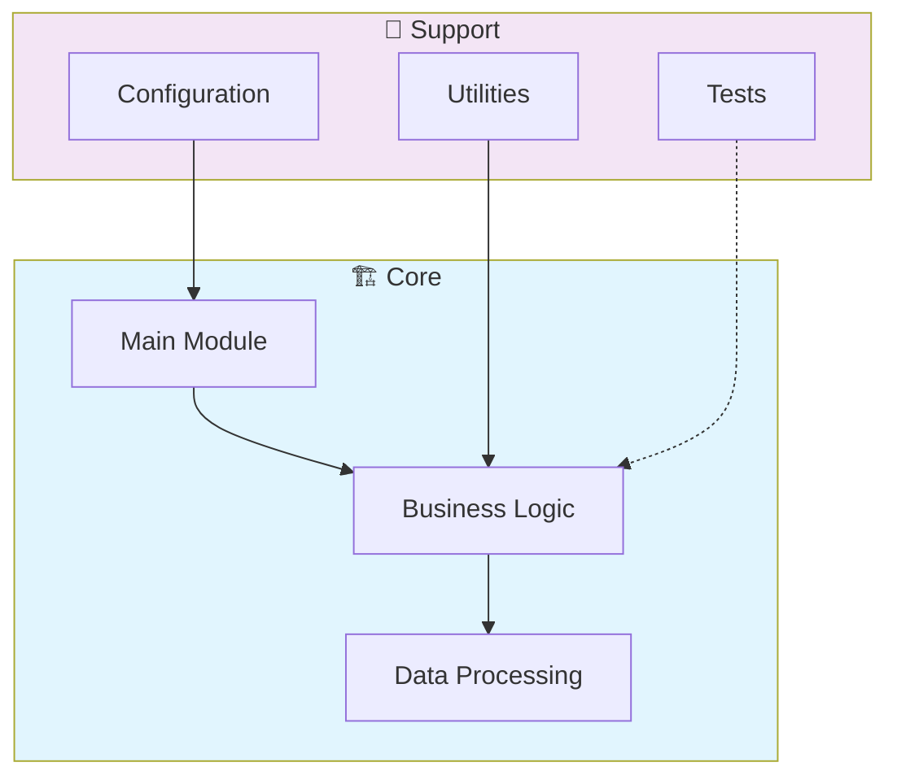

# ⚡ Php Laravel Api

> Professional PHP-Laravel-API - Created by Gabriel Demetrios Lafis

[](LICENSE)

[English](#english) | [Português](#português)

---

## English

### 🎯 Overview

**Php Laravel Api** is a production-grade PHP application complemented by CSS, HTML, JavaScript that showcases modern software engineering practices including clean architecture, comprehensive testing, containerized deployment, and CI/CD readiness.

The codebase comprises **3,030 lines** of source code organized across **61 modules**, following industry best practices for maintainability, scalability, and code quality.

### ✨ Key Features

- **📐 Clean Architecture**: Modular design with clear separation of concerns
- **🧪 Test Coverage**: Unit and integration tests for reliability
- **📚 Documentation**: Comprehensive inline documentation and examples
- **🔧 Configuration**: Environment-based configuration management

### 🏗️ Architecture



### 🚀 Quick Start

#### Prerequisites

#### Installation

```bash
git clone https://github.com/galafis/PHP-Laravel-API.git
cd PHP-Laravel-API
```

### 🧪 Testing

Run the test suite to verify everything works correctly.

### 📁 Project Structure

```
PHP-Laravel-API/
├── PHP-Laravel-API/
│   └── docs/          # Documentation
│       └── hero-image.txt
├── app/          # Source code
│   ├── Console/
│   ├── Exceptions/
│   ├── Http/
│   │   ├── Controllers/
│   │   └── Middleware/
│   ├── Models/        # Data models
│   └── Providers/
├── bootstrap/
│   └── cache/
├── config/        # Configuration
├── database/
│   ├── factories/
│   ├── migrations/
│   └── seeders/
├── docs/          # Documentation
├── public/
│   └── robots.txt
├── resources/
│   ├── css/
│   ├── js/
│   │   ├── app.js
│   │   └── bootstrap.js
│   └── views/
├── routes/
├── storage/
│   ├── app/          # Source code
│   │   └── public/
│   ├── framework/
│   │   ├── cache/
│   │   ├── sessions/
│   │   ├── testing/
│   │   └── views/
│   └── logs/
├── tests/         # Test suite
│   ├── Feature/
│   └── Unit/
├── LICENSE
├── README.md
├── composer.json
├── package.json
└── vite.config.js
```

### 🔒 Security Considerations

| Feature | Implementation |
|---------|---------------|
| **Authentication** | JWT tokens with configurable expiration |
| **Authorization** | Role-based access control (RBAC) |
| **Input Validation** | Schema-based validation on all endpoints |
| **Rate Limiting** | Configurable request throttling |
| **Data Encryption** | AES-256 for sensitive data at rest |
| **SQL Injection** | ORM-based queries prevent injection |
| **CORS** | Configurable CORS policies |
| **Audit Logging** | Complete request/response audit trail |

> ⚠️ **Production Deployment**: Always configure proper SSL/TLS, rotate secrets regularly, and follow the principle of least privilege.

### 🛠️ Tech Stack

| Technology | Description | Role |
|------------|-------------|------|
| JavaScript | 3 files | Supporting |
| HTML | 1 files | Supporting |
| CSS | 1 files | Supporting |

### 🤝 Contributing

Contributions are welcome! Please feel free to submit a Pull Request. For major changes, please open an issue first to discuss what you would like to change.

1. Fork the project
2. Create your feature branch (`git checkout -b feature/AmazingFeature`)
3. Commit your changes (`git commit -m 'Add some AmazingFeature'`)
4. Push to the branch (`git push origin feature/AmazingFeature`)
5. Open a Pull Request

### 📄 License

This project is licensed under the MIT License - see the [LICENSE](LICENSE) file for details.

### 👤 Author

**Gabriel Demetrios Lafis**
- GitHub: [@galafis](https://github.com/galafis)
- LinkedIn: [Gabriel Demetrios Lafis](https://linkedin.com/in/gabriel-demetrios-lafis)

---

## Português

### 🎯 Visão Geral

**Php Laravel Api** é uma aplicação PHP de nível profissional, complementada por CSS, HTML, JavaScript que demonstra práticas modernas de engenharia de software, incluindo arquitetura limpa, testes abrangentes, implantação containerizada e prontidão para CI/CD.

A base de código compreende **3,030 linhas** de código-fonte organizadas em **61 módulos**, seguindo as melhores práticas do setor para manutenibilidade, escalabilidade e qualidade de código.

### ✨ Funcionalidades Principais

- **📐 Clean Architecture**: Modular design with clear separation of concerns
- **🧪 Test Coverage**: Unit and integration tests for reliability
- **📚 Documentation**: Comprehensive inline documentation and examples
- **🔧 Configuration**: Environment-based configuration management

### 🏗️ Arquitetura


### 🚀 Início Rápido

#### Prerequisites

#### Installation

```bash
git clone https://github.com/galafis/PHP-Laravel-API.git
cd PHP-Laravel-API
```

### 🧪 Testing

Run the test suite to verify everything works correctly.

### 📁 Estrutura do Projeto

```
PHP-Laravel-API/
├── PHP-Laravel-API/
│   └── docs/          # Documentation
│       └── hero-image.txt
├── app/          # Source code
│   ├── Console/
│   ├── Exceptions/
│   ├── Http/
│   │   ├── Controllers/
│   │   └── Middleware/
│   ├── Models/        # Data models
│   └── Providers/
├── bootstrap/
│   └── cache/
├── config/        # Configuration
├── database/
│   ├── factories/
│   ├── migrations/
│   └── seeders/
├── docs/          # Documentation
├── public/
│   └── robots.txt
├── resources/
│   ├── css/
│   ├── js/
│   │   ├── app.js
│   │   └── bootstrap.js
│   └── views/
├── routes/
├── storage/
│   ├── app/          # Source code
│   │   └── public/
│   ├── framework/
│   │   ├── cache/
│   │   ├── sessions/
│   │   ├── testing/
│   │   └── views/
│   └── logs/
├── tests/         # Test suite
│   ├── Feature/
│   └── Unit/
├── LICENSE
├── README.md
├── composer.json
├── package.json
└── vite.config.js
```

### 🔒 Security Considerations

| Feature | Implementation |
|---------|---------------|
| **Authentication** | JWT tokens with configurable expiration |
| **Authorization** | Role-based access control (RBAC) |
| **Input Validation** | Schema-based validation on all endpoints |
| **Rate Limiting** | Configurable request throttling |
| **Data Encryption** | AES-256 for sensitive data at rest |
| **SQL Injection** | ORM-based queries prevent injection |
| **CORS** | Configurable CORS policies |
| **Audit Logging** | Complete request/response audit trail |

> ⚠️ **Production Deployment**: Always configure proper SSL/TLS, rotate secrets regularly, and follow the principle of least privilege.

### 🛠️ Stack Tecnológica

| Tecnologia | Descrição | Papel |
|------------|-----------|-------|
| JavaScript | 3 files | Supporting |
| HTML | 1 files | Supporting |
| CSS | 1 files | Supporting |

### 🤝 Contribuindo

Contribuições são bem-vindas! Sinta-se à vontade para enviar um Pull Request.

### 📄 Licença

Este projeto está licenciado sob a Licença MIT - veja o arquivo [LICENSE](LICENSE) para detalhes.

### 👤 Autor

**Gabriel Demetrios Lafis**
- GitHub: [@galafis](https://github.com/galafis)
- LinkedIn: [Gabriel Demetrios Lafis](https://linkedin.com/in/gabriel-demetrios-lafis)
